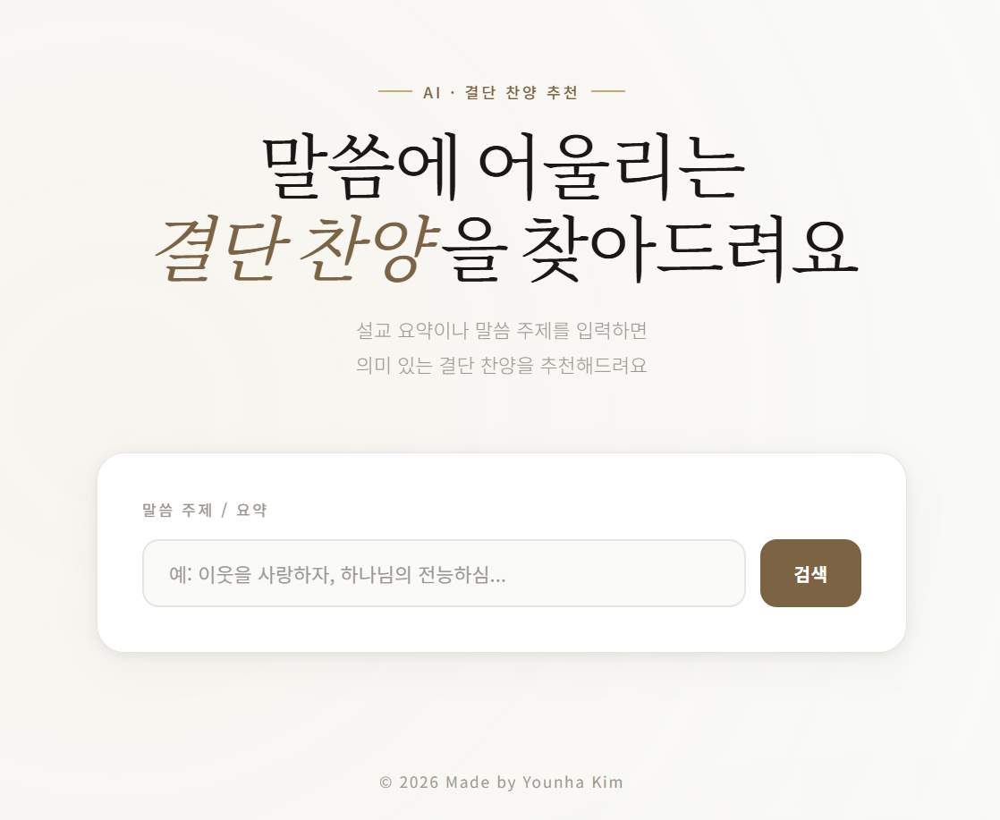

# KoreanCCM-RAG

> RAG-based Korean CCM retrieval system for searching worship songs by sermon topic or scripture theme
> 🔗KoCCM web link: [`KoCCM`](https://www.koccm.co.kr)

---

## Overview

말씀을 묵상하고 그에 맞는 결단 찬양을 드리고 싶을 때, 주제에 맞는 찬양을 찾는 일은 생각보다 쉽지 않습니다.  
**KoreanCCM-RAG**는 설교 요약이나 말씀 주제를 입력하면 가사 의미 기반으로 어울리는 CCM을 추천해주는 시스템입니다.

---

## Demo

> 설교 주제 또는 말씀 키워드를 입력하면 Top-5 결단 찬양을 추천합니다.



---

## Pipeline

```
Melon Crawling (CCM 1~1500위)
        ↓
Bossssss/CCM-list (HuggingFace)
        ↓
rag_data_gen.py → Triplet Dataset Generation
        ↓
Bossssss/ccm-retrieval-dataset (HuggingFace)
        ↓
retriever_train.py → Retriever Fine-tuning
        ↓
Bossssss/ccm-retriever (HuggingFace)
        ↓
save_faiss_idx.py → Save FAISS Index
        ↓
main.py (FastAPI) + index.html (Frontend)
```

---

## Datasets

### 1. [`Bossssss/CCM-list`](https://huggingface.co/datasets/Bossssss/CCM-list)
멜론 장르 차트 국내 CCM 1위~1500위(2024년 11월 19일 기준)를 크롤링하여 수집했습니다.

| 필드 | 설명 |
|------|------|
| `title` | 곡 제목 |
| `artist` | 아티스트 |
| `lyrics` | 가사 전문 |

### 2. [`Bossssss/ccm-retrieval-dataset`](https://huggingface.co/datasets/Bossssss/ccm-retrieval-dataset)
Retriever 학습을 위한 Triplet 데이터셋입니다. (`rag_data_gen.py`)

- **Anchor**: 곡 제목 (괄호 제거 후 정제)
- **Positive**: 해당 곡의 가사 전문
- **Negative**: 다른 곡의 가사 (랜덤 샘플링)

---

## Model

### [`Bossssss/ccm-retriever`](https://huggingface.co/Bossssss/ccm-retriever)

| 항목 | 내용 |
|------|------|
| Base Model | `BM-K/KoSimCSE-roberta` |
| Fine-tuning | `MultipleNegativesRankingLoss` |
| Batch Size | 32 |
| Epochs | 2 |
| Learning Rate | 2e-5 |
| Max Length | 256 |

---

## How It Works

1. `save_faiss_idx.py`로 전체 CCM 가사를 벡터로 인코딩하여 FAISS 인덱스에 저장
2. 사용자가 말씀 주제 또는 설교 요약을 입력
3. 입력 텍스트를 동일한 모델로 벡터화
4. FAISS Inner Product Search로 가장 유사한 가사의 곡을 Top-K 검색
5. 중복 제거 (제목/첫 가사 기준) 후 결과 반환

---

## Project Structure

```
KoreanCCM-RAG/
├── main.py                # FastAPI 백엔드
├── index.html             # 프론트엔드
├── rag_data_gen.py        # Triplet 데이터셋 생성
├── retriever_train.py     # Retriever 파인튜닝
└── save_faiss_idx.py      # FAISS 인덱스 저장
```

---

## Getting Started

### 1. 설치

```bash
pip install fastapi uvicorn faiss-cpu sentence-transformers datasets
```

### 2. FAISS 인덱스 생성

```bash
python save_faiss_idx.py
```

### 3. 서버 실행

```bash
uvicorn main:app --reload
```

### 4. 접속

```
http://localhost:8000
```

---

## Tech Stack

`Python` `FastAPI` `FAISS` `Sentence-Transformers` `HuggingFace` `HTML/CSS/JS`

---

© 2026 Made by Younha Kim
